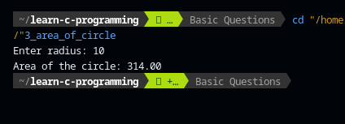

# Basic Questions

[](https://github.com/ComputeNepal/learn-c-programming "Go to GitHub repo")
[](https://github.com/ComputeNepal/learn-c-programming)
[](https://github.com/ComputeNepal/learn-c-programming)

[](#license)
[](https://github.com/ComputeNepal/learn-c-programming/issues)

[](/CONTRIBUTING.md "Go to contributions doc")


## 1. WAP to find out wether a given number is positive negative or zero.

### Program

```c
// WAP to find wether the given number is positive, negative or zero.

#include <stdio.h>
int main(){
    int a;
    printf("Enter a number: ");
    scanf("%d", &a);
    if(a == 0)
        printf("Zero\n");
    else if (a > 0)
        printf("Positive\n");
    else
        printf("Negative\n");
    return 0;
}
```

This is a simple program that prompts the user to enter an integer, reads the
integer from the console using scanf(), and then determines whether the number
is positive, negative, or zero. Here's how the program works:

- The program declares an integer variable a.

- The program prompts the user to enter a number and reads the number from the
  console using scanf().

- The program checks if a is equal to 0. If it is, the program prints "Zero"
  using printf().

- If a is not equal to 0, the program checks if a is greater than 0. If it is,
  the program prints "Positive" using printf().

- If a is not equal to 0 and is not greater than 0, the program assumes that a
  is negative and prints "Negative" using printf().

- The program returns 0 to indicate successful completion.

For example, if the user enters 10, the program will output "Positive". If the
user enters -5, the program will output "Negative". And if the user enters 0,
the program will output "Zero".

_output_


## 2. WAP that reads the principal, rate of interest and number of years and find the simple interest and amount.

### Program

```c
// WAP that reads the principal, rate of interest and number of years and find the simple interest and amount.

#include <stdio.h>
int main(){
    float p, t, r, a, i;
    printf("Enter principal: ");
    scanf("%f",&p);
    printf("Enter rate: ");
    scanf("%f",&r);
    printf("Enter time: ");
    scanf("%f",&t);

    i = (p*t*r)/100;

    a = p+i;

    printf("The simple interest is: %0.2f, and amount is %0.2f.\n",i, a);

    return 0;
}
```

This is a simple program that calculates the simple interest and amount based on
the given principal, rate of interest, and number of years. Here's how the
program works:

- The program declares five float variables: p for principal, t for time, r for
  rate of interest, a for amount, and i for simple interest.

- The program prompts the user to enter the principal, rate of interest, and
  number of years using three separate printf() statements and reads the values
  from the console using three separate scanf() statements.

- The program calculates the simple interest i using the formula (p*t*r)/100.
  This formula calculates the simple interest by multiplying the principal p,
  time t, and rate of interest r and dividing the result by 100.

- The program calculates the amount a by adding the principal p and the simple
  interest i.

- The program uses printf() to display the simple interest and amount. The
  "%0.2f" format specifier is used to print the float values with two decimal
  places.

- The program returns 0 to indicate successful completion.

For example, if the user enters principal=1000, rate=5, and time=2, the program
will output "The simple interest is: 100.00, and amount is 1100.00." This means
that the simple interest is 100.00 and the total amount after 2 years is
1100.00.

#### Output


## 3. WAP to read the radius of circle and display its area.

### Program

```c
//WAP to read the radius of circle and display its area.

#include<stdio.h>
int main(){
    float r, pi=3.14, a;
    printf("Enter radius: ");
    scanf("%f",&r);
    a = pi*r*r;
    printf("Area of the circle: %0.2f\n",a);
    return 0;
}
```

This is a C program to calculate the area of a circle. It takes the radius of
the circle as input from the user using the scanf() function, and calculates the
area using the formula pi*r*r where pi is the mathematical constant representing
the ratio of the circumference of a circle to its diameter (approximately equal
to 3.14).

The calculated area is stored in the variable a, and then printed on the screen
using the printf() function with the appropriate format specifier %0.2f to
display the output up to 2 decimal places.

Finally, the program returns 0 indicating successful execution of the program.

#### Output



## 4. WAP that reads three numbers and displays the largest among them.

### Program

```c
//WAP that reads three numbers and displays the largest among them.

#include <stdio.h>
int main(){
    int a,b,c, largest;
    printf("Enter three numbers :");
    scanf("%d%d%d",&a,&b,&c);
    if(a == b || b ==c || c==a){
        printf("Input unequal numbers\n");
        return 0;
    }
    if(a > b && a > c)
        largest = a;
    else if(b >a && b >c)
        largest = b;
    else
        largest = c;
    printf("Large number is: %d\n",largest);
    return 0;
}
```

This is a C program that reads three integers from the user and then finds the
largest among them using conditional statements.

The program first prompts the user to enter three numbers using the printf()
function and then reads the input values into variables a, b, and c using the
scanf() function.

Next, it checks if any two of the entered numbers are equal or not using an
if-statement with multiple conditions. If any two numbers are equal, the program
prints "Input unequal numbers" and exits the program by returning 0.

If all three input values are different, then the program finds the largest of
the three numbers using nested if-else statements. It compares a with b and c to
find the largest value and stores it in the variable largest.

Finally, it prints the value of largest using the printf() function with the
appropriate format specifier %d, indicating the largest number among the input
values.

## 5. WAP to display the name of the day in a week, depending on the number entered through the keyboard using the switch-case statement.

### Program

```c
// WAP to display the name of the day in a week, depending on the number entered through the keyboard using the switch-case statement.

#include <stdio.h>
int main(){
    int ch;
    printf("Enter choice (1-7): ");
    scanf("%d",&ch);
    switch(ch){
        case 1:
            printf("Sunday");
            break;
        case 2:
            printf("Monday");
            break;
        case 3:
            printf("Tuesday");
            break;
        case 4:
            printf("Wednesday");
            break;
        case 5:
            printf("Thursday");
            break;
        case 6:
            printf("Friday");
            break;
        case 7:
            printf("Saturday");
            break;
        default:
            printf("Invalid choice");
            break;
    }
    return 0;
}
```

This program prompts the user to enter a number between 1 and 7, representing a
day of the week, and uses a switch-case statement to display the corresponding
day name.

The program starts by declaring an integer variable ch to store the user input.
It then prompts the user to enter a choice between 1 and 7, and reads the input
using the scanf() function.

Next, the program uses a switch-case statement to determine the day of the week
corresponding to the user input. Each case represents a number between 1 and 7,
and displays the corresponding day name using the printf() function. If the user
enters a number outside the range of 1 to 7, the default case is executed, which
displays an error message.

Finally, the program returns 0 to indicate successful execution of the program.

## 6. WAP to display all the natural numbers up to 100.

```c
//WAP to display all the natural numbers upto 100.

#include <stdio.h>
int main(){
    for(int i =1; i <=100; i++){
        printf("%d\t", i);
    }
    return 0;
}
```

This program displays all the natural numbers from 1 to 100 using a for loop.

The program starts by initializing a variable i to 1. Then it enters into the
for loop where it checks the condition i<=100. As long as this condition is
true, the loop body will be executed, and the value of i will be printed on the
console using printf() function followed by a tab character \t. The loop
continues until the condition becomes false, which happens when i becomes
greater than 100. At this point, the program exits the loop and returns 0.

## 7. WAP to display the sum of 'n' terms of 'even' numbers.

### Program

```c
// WAP to display the sum of 'n' terms of 'even' numbers.

#include <stdio.h>
int main(){
    int n, sum=0;
    printf("Enter a number: ");
    scanf("%d",&n);
    for(int i=1; i <= n; i++){
        if(i % 2 == 0){
            sum += i;
        }
    }
    printf("Sum is %d\n",sum);
    return 0;
}
```

This is a program that takes an input number 'n' from the user and displays the
sum of 'n' terms of even numbers. The program uses a for loop to iterate through
all the integers from 1 to 'n'. In each iteration, it checks whether the integer
is even or not by using the modulo operator (%). If the integer is even, it adds
it to the variable 'sum'. After all the iterations, the final value of 'sum' is
printed to the console.

For example, if the user enters 5, the program will iterate through the integers
1 to 5, and add the even numbers (2 and 4) to the variable 'sum'. Finally, it
will print the value of 'sum', which in this case would be 6 (2+4=6).

## 8. WAP to check given number is palindrome or not.

### Program

```c
// WAP to check given number is palindrome or not.

#include <stdio.h>
int main(){
    int a, rem, sum = 0, tem;
    printf("Enter a number: ");
    scanf("%d",&a);
    tem = a;
    while(a != 0){
        rem = a % 10;
        sum = sum * 10 + rem;
        a /= 10;
    }
    if(sum == tem)
        printf("Palindrome\n");
    else
        printf("Not palindrome\n");
    return 0;
}
```

This program checks if the given number is a palindrome or not. A palindrome
number is a number that remains the same when its digits are reversed.

The program takes an integer input a from the user, which is the number that
needs to be checked. A temporary variable tem is initialized with the value of
a. Then the program enters into a while loop where it extracts the last digit of
the number and adds it to a variable sum which is multiplied by 10 and then adds
the last digit to it. The last digit is removed from a after each iteration
until a becomes 0.

After the loop, the value of sum is compared with the original number tem. If
they are the same, the program prints "Palindrome" which indicates that the
given number is a palindrome. Otherwise, it prints "Not palindrome".

For example, if the user inputs 121, the program extracts each digit (1, 2, 1)
in reverse order and adds them to sum variable. After the loop, sum becomes 121
which is the same as the original number. Therefore, the program prints
"Palindrome".

## 9. WAP to find the factorial of any given number.

### Program

```c
//WAP to find the factorial of any given number.

#include <stdio.h>
int main(){

    int n, p = 1;
    printf("Enter a number: ");
    scanf("%d", &n);
    if(n == 0)
        printf("Factorial is 1");
    else if (n < 0)
        printf("There is no factorial for negative numbers");

    for (int i=1; i<=n; i++){
        p *=i;
    }
    printf("Factorial is %d", p);
    return 0;
}
```

This C program finds the factorial of a given number using a for loop.

The program first declares three variables: n, p, and i.

- n is an integer that will be used to store the user input, which is the number
  for which we need to find the factorial.
- p is another integer variable that is initialized to 1. We will use p to
  calculate the factorial of n.
- i is a loop counter variable that starts at 1 and iterates up to n. The user
  is prompted to enter a number, which is read using the scanf() function and
  stored in the variable n.

The program then checks if the value of n is 0 or negative. If n is 0, the
factorial is 1, and the program prints the output. If n is negative, there is no
factorial, and the program prints an error message.

If n is a positive integer, the program uses a for loop to calculate the
factorial. The loop starts at 1 and iterates up to n. In each iteration, the
value of i is multiplied to p. The final value of p is the factorial of n.

Finally, the program prints the output, which is the value of p.

#### Output


<!-- Add new question above this comment -->

## License

Released under [MIT](/LICENSE) by [@ComputeNepal](https://github.com/ComputeNepal).

[](https://computenepal.com)
