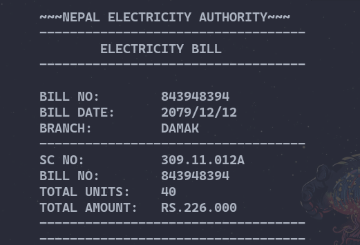

# Miscellaneous 

[](https://github.com/ComputeNepal/learn-c-programming "Go to GitHub repo")
[](https://github.com/ComputeNepal/learn-c-programming)
[](https://github.com/ComputeNepal/learn-c-programming)

[](#license)
[](https://github.com/ComputeNepal/learn-c-programming/issues)

[](/CONTRIBUTING.md "Go to contributions doc")


## 1. WAP to build a simple electricity bill generator.

### Program
```c
//A simple program of electricity bill generator

#include<stdio.h>
#include <stdlib.h>

int main(){
  int units;
  float price;

  printf("Enter the units:\t");
  scanf("%d",&units);
  system("clear");

  if(units<=20){
    price=units*4;
  }
  else if(units<=50){
      price=(20*4)+((units-20)*7.3);
  }

  else if(units<=150){
      price=((20*4)+(50*7.3))+((units-50)*8.6);
  }
  else if(units<=250){
      price=(20*4+30*7.3+100*8.6)+((units-150)*9.5);
    }
  else if(units>250){
      price=(20*4+30*7.3+100*8.6+100*9.5)+((units-250)*12.5);
  }

  //you can automate the bill no, date and sc no for advancement
  printf("~~~NEPAL ELECTRICITY AUTHORITY~~~\n");
  printf("-----------------------------------\n");
  printf("\tELECTRICITY BILL\n");
  printf("-----------------------------------\n\n");   
  printf("BILL NO:\t843948394\n");
  printf("BILL DATE:\t2079/12/12\n");
  printf("BRANCH:\t\tDAMAK\n");
  printf("-----------------------------------\n");
  printf("SC NO:\t\t309.11.012A\n");
  printf("BILL NO:\t843948394\n");
  printf("TOTAL UNITS:\t%d\n",units);
  printf("TOTAL AMOUNT:\tRS.%.3f\n",price);
  printf("-----------------------------------\n");
  printf("-----------------------------------\n");
  return 0;
}
```

This C program allows a user to input total electricity units and generate
the bill in proper format.

The basic logic of this C program is to take an integer 'units' as input 
from the user and the if else ladder checks suitable case for the units.
If the unit is less than or equals to 20 units, then the rate is Rs.4 per 
unit which is assigned to 'price'. But if the units exceeds 20 and less
than or equals to 50 then the price of 20 units is added to the price of 
remaining units. Same case continues untill 250 units. If the unit is more
than 250 then the total sum price of 250 units is added to price of remaining 
units. After 250 units the rate is Rs.12.5 per unit even if the unit is way
heigher.

Finally the bill is generated through a self written format which includes
Bill no, Bill date, Total units, Total amount,etc.

For example, if the user input is 40 then the bill is generated for 40 units.

_output_




## 2. WAP to create guess the number game.

### Program

```c
#include<stdio.h>
#include<stdlib.h>
#include<time.h>
int main(){
    int number, guess, gNo = 1;
    srand(time(0));
    //generation of random number between 0 and 100
    number = rand() % 100 + 1;
    do{
        printf("Enter the number between 0 and 100: ");
        scanf("%d", &guess);
        if(guess > number){
            printf("Try Smaller number\n");
        }else if (guess < number){
            printf("Try Greater number\n");
        }else{
            printf("Guesses: %d", gNo);
        }
        gNo++;
    }while(guess != number);
    return 0;
}
```

This is a basic Game in C in which you can guess a number between 0 and 100.

- Computer generates a random number between 0 and 100
- You enter a number between 0 and 100
- If the number is smaller than generated, the computer gives you a hint and vice versa.