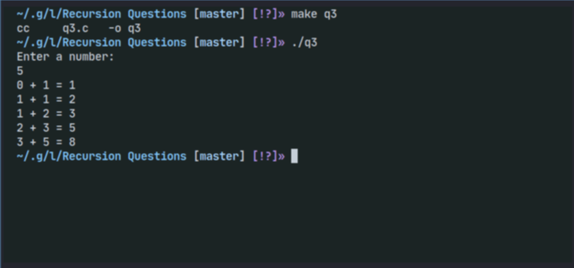

# Recursion Questions

[](https://github.com/ComputeNepal/learn-c-programming "Go to GitHub repo")
[](https://github.com/ComputeNepal/learn-c-programming)
[](https://github.com/ComputeNepal/learn-c-programming)

[](#license)
[](https://github.com/ComputeNepal/learn-c-programming/issues)

[](/CONTRIBUTING.md "Go to contributions doc")


## 1. WAP to calculate the factorial of a given number using function.

### Program

```c
//WAP to calculate the factorial of a given number using function.

#include<stdio.h>
int factorial(int);
int main(){
    int n;
    printf("Enter a number: ");
    scanf("%d",&n);
    printf("Factorial: %d\n", factorial(n));
    return 0;
}
int factorial(int n){
    if(n != 1)
        return n * factorial(n-1);
    else
        return 1;
}
```

This program calculates the factorial of a given number using a recursive
function called factorial().

In the main() function, the user is prompted to enter a number, which is stored
in the integer variable n. The factorial() function is then called, passing n as
an argument. The value returned by factorial() is printed to the console, which
is the factorial of n.

The factorial() function takes an integer n as input and recursively calculates
its factorial. If n is not equal to 1, factorial() multiplies n by the result of
calling factorial(n-1). This process continues until n is equal to 1. At that
point, the function returns 1, which is the base case of the recursion.

_output_


## 2. WAP to calculate a term of Fibonacci series using a recursive function.

### Program

```c
//WAP to calculate a term of Fibonacci series using a recursive function.

#include <stdio.h>

int fibonacci(int n);

int main() {
    int n;

    printf("Enter a positive integer: ");
    scanf("%d", &n);

    printf("The %dth term in the Fibonacci sequence is: %d\n", n, fibonacci(n));

    return 0;
}

int fibonacci(int n) {
    if (n == 0) {
        return 0;
    } else if (n == 1) {
        return 1;
    } else {
        return fibonacci(n-1) + fibonacci(n-2);
    }
}
```

This program calculates the nth term in the Fibonacci series using a recursive
function.

The Fibonacci series is a sequence of numbers where each number is the sum of
the two preceding ones, starting from 0 and 1. For example, the first few terms
of the Fibonacci series are: 0, 1, 1, 2, 3, 5, 8, 13, 21, 34, ...

The program takes an integer input 'n' from the user, which specifies which term
of the Fibonacci series to calculate. It then calls the recursive function
'fibonacci' with 'n' as the argument.

The 'fibonacci' function is defined as follows:

- If n is 0, it returns 0 (the first term in the series)
- If n is 1, it returns 1 (the second term in the series)
- Otherwise, it calculates the nth term by recursively calling the 'fibonacci'
  function with n-1 and n-2 as arguments, and returning the sum of the two
  results.

The program then prints out the value returned by the 'fibonacci' function,
which is the nth term of the Fibonacci series.

## 3. WAP to calculate a term of Fibonacci series using a recursive function and static keyword.

### Program

```c
// fibonacci using recursion (static)
#include <stdio.h>

int fibonacci(int);

int main(int argc, char *argv[]) {
  int num;
  printf("Enter a number:\n");
  scanf("%d", &num);
  fibonacci(num);
  return 0;
}

int fibonacci(int x) {
  static int a = 0, b = 1, c;
  if (x > 0) {
    c = a + b;
    printf("%d + %d = %d\n", a, b, c);
    a = b;
    b = c;
    fibonacci(x - 1);
  }
  return 0;
}
```

This program prints out the fibonacci series , for the (specified) number of
times.

By taking and input from an user and passing it to a user-defined-function, we
are able to create such series.

What is _static_ keyword? What does it do?
[SEE THIS](https://www.javatpoint.com/static-in-c)

#### OUTPUT



<!-- Add new question above this comment -->

## License

Released under [MIT](/LICENSE) by [@ComputeNepal](https://github.com/ComputeNepal).

[](https://computenepal.com)
