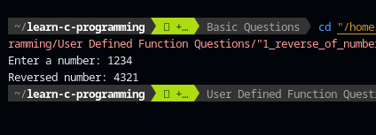

# User Defined Function Questions

[](https://github.com/ComputeNepal/learn-c-programming "Go to GitHub repo")
[](https://github.com/ComputeNepal/learn-c-programming)
[](https://github.com/ComputeNepal/learn-c-programming)

[](#license)
[](https://github.com/ComputeNepal/learn-c-programming/issues)

[](/CONTRIBUTING.md "Go to contributions doc")


## 1. WAP to input a number and calculate its reverse using function.

### Program

```c
//WAP to input a number and calculate its reverse using function.

#include <stdio.h>

int reverse(int);
int main(){
    int a;
    printf("Enter a number: ");
    scanf("%d",&a);
    printf("Reversed number: %d\n", reverse(a));
    return 0;
}
int reverse(int a){
    int rem, temp, rev=0;
    while(a != 0){
        rem = a%10;
        rev = rev * 10 + rem;
        a /= 10;
    }
    return rev;
}
```

This program is a C code that takes an integer input from the user, and then
calculates and outputs its reverse using a function.

The program first declares the reverse function, which takes an integer input
and returns its reverse. Within the reverse function, the program uses a while
loop to extract the digits of the number in reverse order and store them in a
new variable rev. The loop iterates until the original number becomes 0.
Finally, the function returns the reversed number rev.

In the main function, the program prompts the user to input a number and stores
it in the variable a. Then, it calls the reverse function with a as the argument
and outputs the returned value as the reversed number.

Overall, this program demonstrates the use of a function to perform a specific
task, in this case, reversing a given number.

#### Output



## 2. WAP to find the sum of 'n' integer numbers using the function.

### Program

```c
//WAP to find the sum of 'n' integer numbers using the function.

#include <stdio.h>
int sum(int);
int main(){
    int a;
    printf("Enter a number: ");
    scanf("%d",&a);
    printf("Sum: %d\n", sum(a));
    return 0;
}
int sum(int a){
    int n =0;
    for(int i=0; i<=a; i++){
        n+= i;
    }
    return n;
}
```

This program calculates the sum of 'n' integer numbers, where 'n' is the input
provided by the user.

The program consists of a main function and a sum function.

In the main function, an integer variable 'a' is declared and initialized with
the input provided by the user using scanf. Then, the sum function is called
with the input value as its argument. Finally, the sum returned by the function
is printed using printf.

In the sum function, an integer variable 'n' is declared and initialized to
zero. The function then uses a for loop to iterate from 0 to the input value 'a'
provided as its argument. Inside the loop, the loop index 'i' is added to the
variable 'n'. Finally, the function returns the value of 'n', which is the sum
of the integers from 0 to 'a'.

## 3. WAP to input a number and check if it is even or odd using the function.

### Program

```c
//WAP to input a number and check if it is even or odd using the function.

#include <stdio.h>
int checker(int);
int main(){
    int a;
    printf("Enter a number: ");
    scanf("%d",&a);
    if (checker(a) == 1)
        printf("Even");
    else
        printf("Odd");
    return 0;
}
int checker(int a){
    if(a % 2 == 0)
        return 1;
    else
        return 0;
}
```

This program checks whether a given integer is even or odd by using a function
called checker().

In the main() function, the program takes an integer input from the user and
passes it as an argument to the checker() function. The function then checks if
the input number is even or odd by dividing it by 2 and checking if the
remainder is zero. If the remainder is zero, the function returns 1 (which is
treated as true in the if condition), indicating that the input number is even.
If the remainder is not zero, the function returns 0 (which is treated as false
in the if condition), indicating that the input number is odd.

Finally, in the main() function, the program checks the return value of the
checker() function using an if statement. If the return value is 1, the program
prints "Even". Otherwise, it prints "Odd".

## 4. WAP using user-defined function to calculate y raise to power x.

### Program

```c
//WAP using user-defined function to calculate y raise to power x.

#include <stdio.h>
#include <math.h>
long int power(int, int);
int main(){
    int x, y;
    printf("Enter the base and exponent: ");
    scanf("%d%d", &y, &x);
    printf("The value is: %ld", power(y, x));
    return 0;
}
long int power(int y, int x){
    return pow(y, x);
}
```

This program calculates the power of a base number raised to an exponent using a
user-defined function named "power".

The program takes two integer inputs 'x' and 'y' as base and exponent
respectively using the scanf() function. Then, it calls the function 'power(y,
x)' and passes the inputs to the function.

The function 'power' takes two integer arguments 'y' and 'x' and returns a long
integer data type. The function calculates the power of y raised to the x
exponent using the built-in pow() function from math.h library and returns the
result to the main function.

Finally, the program prints the result using printf() function with the format
specifier %ld.

<!-- Add new question above this comment -->

## License

Released under [MIT](/LICENSE) by [@ComputeNepal](https://github.com/ComputeNepal).

[](https://computenepal.com)
