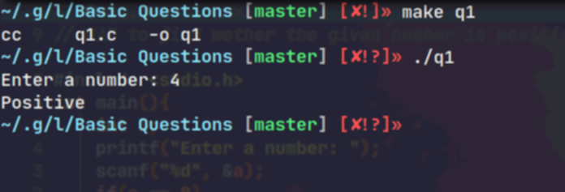
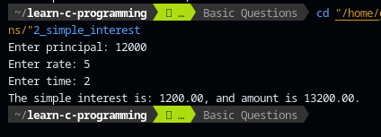
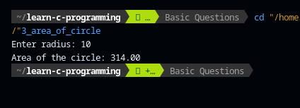
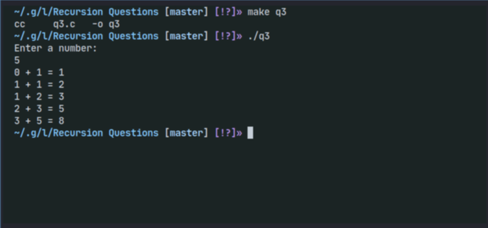

# Beginners C programming Problems

This repo is a collection of multiple C programming problems and their
solutions. Before referring to this repository, it is recommended to know about
the basics of programming like what are variables, loops, data types, functions,
etc.

Make sure to star the repository if you find it useful. And contributions to the
repository are welcome.

- [Beginners C programming Problems](#beginners-c-programming-problems)
  - [Basic Questions](#basic-questions)
    - [1. WAP to find out wether a given number is positive negative or zero.](#1-wap-to-find-out-wether-a-given-number-is-positive-negative-or-zero)
    - [2. WAP that reads the principal, rate of interest and number of years and find the simple interest and amount.](#2-wap-that-reads-the-principal--rate-of-interest-and-number-of-years-and-find-the-simple-interest-and-amount)
    - [3. WAP to read the radius of circle and display its area.](#3-wap-to-read-the-radius-of-circle-and-display-its-area)
    - [4. WAP that reads three numbers and displays the largest among them.](#4-wap-that-reads-three-numbers-and-displays-the-largest-among-them)
    - [5. WAP to display the name of the day in a week, depending on the number entered through the keyboard using the switch-case statement.](#5-wap-to-display-the-name-of-the-day-in-a-week--depending-on-the-number-entered-through-the-keyboard-using-the-switch-case-statement)
    - [6. WAP to display all the natural numbers up to 100.](#6-wap-to-display-all-the-natural-numbers-up-to-100)
    - [7. WAP to display the sum of 'n' terms of 'even' numbers.](#7-wap-to-display-the-sum-of--n--terms-of--even--numbers)
    - [8. WAP to check given number is palindrome or not.](#8-wap-to-check-given-number-is-palindrome-or-not)
    - [9. WAP to find the factorial of any given number.](#9-wap-to-find-the-factorial-of-any-given-number)
    - [10. WAP to find the the product of n natural numbers.](#10-wap-to-find-the-the-product-of-n-natural-numbers)
  - [Array Questions](#array-questions)
    - [1. WAP to input 10 numbers and display the largest and smallest number.](#1-wap-to-input-10-numbers-and-display-the-largest-and-smallest-number)
    - [2. WAP to read the age of 40 students and count the number of students aged between 15 and 22.](#2-wap-to-read-the-age-of-40-students-and-count-the-number-of-students-aged-between-15-and-22)
    - [3. WAP to input several numbers and arrange them in ascending order.](#3-wap-to-input-several-numbers-and-arrange-them-in-ascending-order)
    - [4. WAP to input a matrix of size rXc and transpose it.](#4-wap-to-input-a-matrix-of-size-rxc-and-transpose-it)
    - [5. WAP to input two matrices of size 2X3 and display their sum.](#5-wap-to-input-two-matrices-of-size-2x3-and-display-their-sum)
    - [6. WAP to enter two matrices of size specified by the user and find their product.](#6-WAP-to-input-custom-values-for-two-matrix-along-with-their-rows-and-columns-and-find-the-product-of-those-two-matrices)
  - [String Functions](#string-functions)
    - [1. WAP to count the number of vowels and consonants in a given text.](#1-wap-to-count-the-number-of-vowels-and-consonants-in-a-given-text)
    - [2. WAP to check if a given string is a palindrome or not.](#2-wap-to-check-if-a-given-string-is-a-palindrome-or-not)
    - [3. WAP to input the name of 20 students and arrange them in alphabetical order.](#3-wap-to-input-the-name-of-20-students-and-arrange-them-in-alphabetical-order)
  - [User Defined Function Questions](#user-defined-function-questions)
    - [1. WAP to input a number and calculate its reverse using function.](#1-wap-to-input-a-number-and-calculate-its-reverse-using-function)
    - [2. WAP to find the sum of 'n' integer numbers using the function.](#2-wap-to-find-the-sum-of--n--integer-numbers-using-the-function)
    - [3. WAP to input a number and check if it is even or odd using the function.](#3-wap-to-input-a-number-and-check-if-it-is-even-or-odd-using-the-function)
    - [4. WAP using user-defined function to calculate y raise to power x.](#4-wap-using-user-defined-function-to-calculate-y-raise-to-power-x)
  - [Recursion Questions](#recursion-questions)
    - [1. WAP to calculate the factorial of a given number using function.](#1-wap-to-calculate-the-factorial-of-a-given-number-using-function)
    - [2. WAP to calculate a term of Fibonacci series using a recursive function.](#2-wap-to-calculate-a-term-of-fibonacci-series-using-a-recursive-function)
    - [3. WAP to calculate a term of Fibonacci series using a recursive function and static keyword.](#2-wap-to-calculate-a-term-of-fibonacci-series-using-a-recursive-function-and-static-keyword)
  - [Structure Questions](#structure-questions)
    - [1. WAP that reads roll_no, f_name, l_name, and prints the record on the screen.](#1-wap-that-reads-roll-no--f-name--l-name--and-prints-the-record-on-the-screen)
    - [2. WAP that takes name and marks of 10 students. Display them according to marks in descending order.](#2-wap-that-takes-name-and-marks-of-10-students-display-them-according-to-marks-in-descending-order)
  - [Pointer Questions](#pointer-questions)
    - [1. WAP to check even or odd numbers using pointer.](#1-wap-to-check-even-or-odd-numbers-using-pointer)
    - [2. WAP to swap two numbers using pointer.](#2-wap-to-swap-two-numbers-using-pointer)
  - [File Handling Questions](#file-handling-questions)
    - [1. WAP to input name, roll no, marks of n students and store them in file/ read from file also.](#1-wap-to-input-name--roll-no--marks-of-n-students-and-store-them-in-file--read-from-file-also)
    - [2. WAP to rename and delete a file using rename and remove command.](#2-wap-to-rename-and-delete-a-file-using-rename-and-remove-command)
    - [3. WAP to open a new file and read roll-no, name, address and phone number of students until the user says "no", after reading the data, write it to the file then display the content of the file.](#3-wap-to-open-a-new-file-and-read-roll-no--name--address-and-phone-number-of-students-until-the-user-says--no---after-reading-the-data--write-it-to-the-file-then-display-the-content-of-the-file)
    - [4. WAP to create/open a new file and store roll-no, name, address and phone number of specified number of students](#4-wap-to-create-open-a-new-file-and-store-roll-no-name-address-and-phone-number-of-specified-number-of-students)

<small><i><a href='http://ecotrust-canada.github.io/markdown-toc/'>Table of
contents generated with markdown-toc</a></i></small>

## Basic Questions

### 1. WAP to find out wether a given number is positive negative or zero.

This is a simple program that prompts the user to enter an integer, reads the
integer from the console using scanf(), and then determines whether the number
is positive, negative, or zero. Here's how the program works:

- The program declares an integer variable a.

- The program prompts the user to enter a number and reads the number from the
  console using scanf().

- The program checks if a is equal to 0. If it is, the program prints "Zero"
  using printf().

- If a is not equal to 0, the program checks if a is greater than 0. If it is,
  the program prints "Positive" using printf().

- If a is not equal to 0 and is not greater than 0, the program assumes that a
  is negative and prints "Negative" using printf().

- The program returns 0 to indicate successful completion.

For example, if the user enters 10, the program will output "Positive". If the
user enters -5, the program will output "Negative". And if the user enters 0,
the program will output "Zero".

_output_

## 

### 2. WAP that reads the principal, rate of interest and number of years and find the simple interest and amount.

This is a simple program that calculates the simple interest and amount based on
the given principal, rate of interest, and number of years. Here's how the
program works:

- The program declares five float variables: p for principal, t for time, r for
  rate of interest, a for amount, and i for simple interest.

- The program prompts the user to enter the principal, rate of interest, and
  number of years using three separate printf() statements and reads the values
  from the console using three separate scanf() statements.

- The program calculates the simple interest i using the formula (p*t*r)/100.
  This formula calculates the simple interest by multiplying the principal p,
  time t, and rate of interest r and dividing the result by 100.

- The program calculates the amount a by adding the principal p and the simple
  interest i.

- The program uses printf() to display the simple interest and amount. The
  "%0.2f" format specifier is used to print the float values with two decimal
  places.

- The program returns 0 to indicate successful completion.

For example, if the user enters principal=1000, rate=5, and time=2, the program
will output "The simple interest is: 100.00, and amount is 1100.00." This means
that the simple interest is 100.00 and the total amount after 2 years is
1100.00.

#### Output

### 3. WAP to read the radius of circle and display its area.

This is a C program to calculate the area of a circle. It takes the radius of
the circle as input from the user using the scanf() function, and calculates the
area using the formula pi*r*r where pi is the mathematical constant representing
the ratio of the circumference of a circle to its diameter (approximately equal
to 3.14).

The calculated area is stored in the variable a, and then printed on the screen
using the printf() function with the appropriate format specifier %0.2f to
display the output up to 2 decimal places.

Finally, the program returns 0 indicating successful execution of the program.

#### Output

### 4. WAP that reads three numbers and displays the largest among them.

This is a C program that reads three integers from the user and then finds the
largest among them using conditional statements.

The program first prompts the user to enter three numbers using the printf()
function and then reads the input values into variables a, b, and c using the
scanf() function.

Next, it checks if any two of the entered numbers are equal or not using an
if-statement with multiple conditions. If any two numbers are equal, the program
prints "Input unequal numbers" and exits the program by returning 0.

If all three input values are different, then the program finds the largest of
the three numbers using nested if-else statements. It compares a with b and c to
find the largest value and stores it in the variable largest.

Finally, it prints the value of largest using the printf() function with the
appropriate format specifier %d, indicating the largest number among the input
values.

### 5. WAP to display the name of the day in a week, depending on the number entered through the keyboard using the switch-case statement.

This program prompts the user to enter a number between 1 and 7, representing a
day of the week, and uses a switch-case statement to display the corresponding
day name.

The program starts by declaring an integer variable ch to store the user input.
It then prompts the user to enter a choice between 1 and 7, and reads the input
using the scanf() function.

Next, the program uses a switch-case statement to determine the day of the week
corresponding to the user input. Each case represents a number between 1 and 7,
and displays the corresponding day name using the printf() function. If the user
enters a number outside the range of 1 to 7, the default case is executed, which
displays an error message.

Finally, the program returns 0 to indicate successful execution of the program.

### 6. WAP to display all the natural numbers up to 100.

This program displays all the natural numbers from 1 to 100 using a for loop.

The program starts by initializing a variable i to 1. Then it enters into the
for loop where it checks the condition i<=100. As long as this condition is
true, the loop body will be executed, and the value of i will be printed on the
console using printf() function followed by a tab character \t. The loop
continues until the condition becomes false, which happens when i becomes
greater than 100. At this point, the program exits the loop and returns 0.

### 7. WAP to display the sum of 'n' terms of 'even' numbers.

This is a program that takes an input number 'n' from the user and displays the
sum of 'n' terms of even numbers. The program uses a for loop to iterate through
all the integers from 1 to 'n'. In each iteration, it checks whether the integer
is even or not by using the modulo operator (%). If the integer is even, it adds
it to the variable 'sum'. After all the iterations, the final value of 'sum' is
printed to the console.

For example, if the user enters 5, the program will iterate through the integers
1 to 5, and add the even numbers (2 and 4) to the variable 'sum'. Finally, it
will print the value of 'sum', which in this case would be 6 (2+4=6).

### 8. WAP to check given number is palindrome or not.

This program checks if the given number is a palindrome or not. A palindrome
number is a number that remains the same when its digits are reversed.

The program takes an integer input a from the user, which is the number that
needs to be checked. A temporary variable tem is initialized with the value of
a. Then the program enters into a while loop where it extracts the last digit of
the number and adds it to a variable sum which is multiplied by 10 and then adds
the last digit to it. The last digit is removed from a after each iteration
until a becomes 0.

After the loop, the value of sum is compared with the original number tem. If
they are the same, the program prints "Palindrome" which indicates that the
given number is a palindrome. Otherwise, it prints "Not palindrome".

For example, if the user inputs 121, the program extracts each digit (1, 2, 1)
in reverse order and adds them to sum variable. After the loop, sum becomes 121
which is the same as the original number. Therefore, the program prints
"Palindrome".

### 9. WAP to find the factorial of any given number.

This C program finds the factorial of a given number using a for loop.

The program first declares three variables: n, p, and i.

- n is an integer that will be used to store the user input, which is the number
  for which we need to find the factorial.
- p is another integer variable that is initialized to 1. We will use p to
  calculate the factorial of n.
- i is a loop counter variable that starts at 1 and iterates up to n. The user
  is prompted to enter a number, which is read using the scanf() function and
  stored in the variable n.

The program then checks if the value of n is 0 or negative. If n is 0, the
factorial is 1, and the program prints the output. If n is negative, there is no
factorial, and the program prints an error message.

If n is a positive integer, the program uses a for loop to calculate the
factorial. The loop starts at 1 and iterates up to n. In each iteration, the
value of i is multiplied to p. The final value of p is the factorial of n.

Finally, the program prints the output, which is the value of p.

### 10. WAP to find the the product of n natural numbers.

This is a C program that calculates the product of the first n natural numbers.
Here's how it works:

1. The program starts by declaring some variables: n, i, and product.

- n is the number of natural numbers to be multiplied.
- i is a counter variable for the loop that will calculate the product.
- product is the variable that will hold the result of the multiplication.

2. The program prompts the user to enter a positive integer n using the printf
   and scanf functions.

3. A for loop is used to calculate the product of the first n natural numbers.
   The loop starts with i = 1 and continues until i <= n.

- Inside the loop, the product is updated by multiplying it with the current
  value of i.

4. After the loop is complete, the program prints the result using printf.

5. The main function returns 0, indicating successful execution.

## Array Questions

### 1. WAP to input 10 numbers and display the largest and smallest number.

This program reads 10 numbers from the user and finds the largest and smallest
number among them using two for loops.

First, it declares an integer array of size 10 to store the numbers entered by
the user. Then, it prompts the user to enter 10 numbers one by one using a for
loop and scanf function.

After that, it sets the initial values of largest and smallest as the first and
second elements of the array, respectively. It then uses another for loop to
compare all the elements of the array with the current value of largest and
smallest. If any element of the array is larger than the current value of
largest, the largest value is updated to that element. Similarly, if any element
of the array is smaller than the current value of smallest, the smallest value
is updated to that element.

Finally, the program prints the largest and smallest numbers found during the
comparison using printf function.

### 2. WAP to read the age of 40 students and count the number of students aged between 15 and 22.

This program is designed to read the age of 40 students and count the number of
students aged between 15 and 22.

Firstly, an integer array a of size 40 is declared to store the age of the 40
students. Then, the program prompts the user to enter the age of each student
using a for loop that runs 40 times. Inside the loop, the scanf function is used
to read each input age and store it in the corresponding element of the a array.

After reading all the ages, another for loop is used to iterate through the a
array and count the number of students whose age is between 15 and 22
(inclusive). If the age of the current student is within the given range, then
the counter variable c is incremented.

Finally, the program displays the number of students aged between 15 and 22
using the printf function. Note that the printf function does not need a format
specifier for the integer c as it is a simple integer value.

### 3. WAP to input several numbers and arrange them in ascending order.

This program takes input of 10 numbers and then arranges them in ascending order
using the bubble sort algorithm.

The input of the program is taken using the scanf() function and stored in an
integer array called "a" with a size of 10.

Then, two for loops are used for comparing and swapping the elements of the
array in ascending order. The outer loop runs from 0 to 9, and the inner loop
runs from i+1 to 9. This is because each element should be compared with all the
remaining elements, which is done by the inner loop.

If an element is found to be greater than the next element, then they are
swapped. The swapping is done using a temporary variable called temp.

Finally, the arranged numbers are printed using a for loop and printf()
function.

### 4. WAP to input a matrix of size rXc and transpose it.

This program takes a 3x3 matrix as input and then transposes it, which means it
converts rows into columns and columns into rows. Here's a step-by-step
explanation of the program:

- The program declares a 3x3 integer array a to store the matrix.
- The program then prompts the user to input the matrix by using two nested
  loops that iterate through each element of the matrix.
- After the matrix is input, the program prints the original matrix by using two
  nested loops to iterate through each element and print it in a tabular format.
- The program then prints the transposed matrix by using two nested loops to
  iterate through each element, but this time, it prints the elements of the
  array in transposed form. This is achieved by swapping the indices of rows and
  columns, so the row index becomes the column index and vice versa.
- Finally, the program exits.

Overall, this program demonstrates how to transpose a matrix in C using two
nested loops to iterate through each element of the matrix.

### 5. WAP to input two matrices of size 2X3 and display their sum.

This program is designed to add two matrices of size 2x3. Here is an explanation
of how the code works:

- Two 2x3 matrices, a and b, are declared.
- The user is prompted to enter the values for the first matrix, and these
  values are stored in a using a nested for loop.
- The user is prompted to enter the values for the second matrix, and these
  values are stored in b using another nested for loop.
- Another nested for loop is used to calculate the sum of the corresponding
  elements of a and b, and the result is printed as a new 2x3 matrix, which
  represents the addition of the two input matrices.

The program works by adding the corresponding elements of a and b using a nested
for loop to iterate over each element. The result is then printed as a new 2x3
matrix using another nested for loop to print each element in a row-column
format.

Note that in order for two matrices to be added, they must be of the same size
and shape (i.e., have the same number of rows and columns).

### 6. WAP to input custom values for two matrix along with their rows and columns and find the product of those two matrices.

- Takes input for the rows and columns from the user
- Passes into a function with the name mult_matrix
- Takes input for the values of those two matrix from the user
- Multiplies the matrices

---

#### LOGIC

The criteria for the multiplication of two matrices is that,

the number columns of the first matrix must be the same as the number of rows of
second matrix.

example: matrices of order, 2x3 & 3x1

are eligible for multiplication

---

## String Functions

### 1. WAP to count the number of vowels and consonants in a given text.

This is a program that counts the number of vowels and consonants in a given
text. The program starts by declaring a character array str with a size of 51,
and two integer variables c and c2 initialized to 0 to count the number of
vowels and consonants, respectively.

The program then prompts the user to enter a string and reads it using the
scanf() function.

Next, the program iterates through each character in the string using a for loop
and checks if the character is a vowel or not. It does this by converting the
character to lowercase using the tolower() function and then comparing it with
the five vowels a, e, i, o, and u. If the character is a vowel, the c variable
is incremented; otherwise, the c2 variable is incremented.

Finally, the program prints the number of vowels and consonants using the
printf() function.

Overall, this program provides a simple example of how to count the number of
vowels and consonants in a given text using basic C language constructs.

### 2. WAP to check if a given string is a palindrome or not.

This program checks if a given string is a palindrome or not. A palindrome is a
string that reads the same backward as forward. Here is how the program works:

- It first takes input from the user in the form of a string using scanf.
- It creates a new string new and copies the input string str into it using the
  strcpy function.
- It finds the length of the string using strlen.
- It then uses a loop to iterate over the first half of the string and swaps
  each character with its corresponding character in the second half of the
  string, effectively reversing the string.
- Finally, it uses the strcmp function to compare the reversed string with the
  original string. If they are the same, it prints "Palindrome", otherwise it
  prints "Not palindrome".

Note that this program assumes that the input string contains only lowercase
letters. If the input string contains uppercase letters, they will not be
recognized as palindromes. Also, the program does not handle cases where the
input string contains spaces or special characters.

### 3. WAP to input the name of 20 students and arrange them in alphabetical order.

This program inputs the names of 20 students and arranges them in alphabetical
order using the strcmp() function to compare the strings.

It first declares a 2D array of characters name of size 20x50 to store the names
and a character array temp of size 50 to temporarily store a name while
swapping.

Then, it prompts the user to input the names of 20 students using a for loop and
scanf() function to read each name.

After that, it uses two nested for loops to compare each name with the other
names using strcmp() function. If the first name is greater than the second
name, the strcpy() function is used to swap the names.

Finally, it prints the arranged names in alphabetical order using a for loop and
printf() function.

## User Defined Function Questions

### 1. WAP to input a number and calculate its reverse using function.

This program is a C code that takes an integer input from the user, and then
calculates and outputs its reverse using a function.

The program first declares the reverse function, which takes an integer input
and returns its reverse. Within the reverse function, the program uses a while
loop to extract the digits of the number in reverse order and store them in a
new variable rev. The loop iterates until the original number becomes 0.
Finally, the function returns the reversed number rev.

In the main function, the program prompts the user to input a number and stores
it in the variable a. Then, it calls the reverse function with a as the argument
and outputs the returned value as the reversed number.

Overall, this program demonstrates the use of a function to perform a specific
task, in this case, reversing a given number.

### 2. WAP to find the sum of 'n' integer numbers using the function.

This program calculates the sum of 'n' integer numbers, where 'n' is the input
provided by the user.

The program consists of a main function and a sum function.

In the main function, an integer variable 'a' is declared and initialized with
the input provided by the user using scanf. Then, the sum function is called
with the input value as its argument. Finally, the sum returned by the function
is printed using printf.

In the sum function, an integer variable 'n' is declared and initialized to
zero. The function then uses a for loop to iterate from 0 to the input value 'a'
provided as its argument. Inside the loop, the loop index 'i' is added to the
variable 'n'. Finally, the function returns the value of 'n', which is the sum
of the integers from 0 to 'a'.

### 3. WAP to input a number and check if it is even or odd using the function.

This program checks whether a given integer is even or odd by using a function
called checker().

In the main() function, the program takes an integer input from the user and
passes it as an argument to the checker() function. The function then checks if
the input number is even or odd by dividing it by 2 and checking if the
remainder is zero. If the remainder is zero, the function returns 1 (which is
treated as true in the if condition), indicating that the input number is even.
If the remainder is not zero, the function returns 0 (which is treated as false
in the if condition), indicating that the input number is odd.

Finally, in the main() function, the program checks the return value of the
checker() function using an if statement. If the return value is 1, the program
prints "Even". Otherwise, it prints "Odd".

### 4. WAP using user-defined function to calculate y raise to power x.

This program calculates the power of a base number raised to an exponent using a
user-defined function named "power".

The program takes two integer inputs 'x' and 'y' as base and exponent
respectively using the scanf() function. Then, it calls the function 'power(y,
x)' and passes the inputs to the function.

The function 'power' takes two integer arguments 'y' and 'x' and returns a long
integer data type. The function calculates the power of y raised to the x
exponent using the built-in pow() function from math.h library and returns the
result to the main function.

Finally, the program prints the result using printf() function with the format
specifier %ld.

## Recursion Questions

### 1. WAP to calculate the factorial of a given number using function.

This program calculates the factorial of a given number using a recursive
function called factorial().

In the main() function, the user is prompted to enter a number, which is stored
in the integer variable n. The factorial() function is then called, passing n as
an argument. The value returned by factorial() is printed to the console, which
is the factorial of n.

The factorial() function takes an integer n as input and recursively calculates
its factorial. If n is not equal to 1, factorial() multiplies n by the result of
calling factorial(n-1). This process continues until n is equal to 1. At that
point, the function returns 1, which is the base case of the recursion.

### 2. WAP to calculate a term of Fibonacci series using a recursive function.

This program calculates the nth term in the Fibonacci series using a recursive
function.

The Fibonacci series is a sequence of numbers where each number is the sum of
the two preceding ones, starting from 0 and 1. For example, the first few terms
of the Fibonacci series are: 0, 1, 1, 2, 3, 5, 8, 13, 21, 34, ...

The program takes an integer input 'n' from the user, which specifies which term
of the Fibonacci series to calculate. It then calls the recursive function
'fibonacci' with 'n' as the argument.

The 'fibonacci' function is defined as follows:

- If n is 0, it returns 0 (the first term in the series)
- If n is 1, it returns 1 (the second term in the series)
- Otherwise, it calculates the nth term by recursively calling the 'fibonacci'
  function with n-1 and n-2 as arguments, and returning the sum of the two
  results.

The program then prints out the value returned by the 'fibonacci' function,
which is the nth term of the Fibonacci series.

### 3. WAP to calculate a term of Fibonacci series using a recursive function and static keyword.

This program prints out the fibonacci series , for the (specified) number of
times.

By taking and input from an user and passing it to a user-defined-function, we
are able to create such series.

What is _static_ keyword? What does it do?
[SEE THIS](https://www.javatpoint.com/static-in-c)

#### OUTPUT

## Structure Questions

### 1. WAP that reads roll_no, f_name, l_name, and prints the record on the screen.

This is a C program that reads the personal details of a student, including
their roll number, first name, and last name, and prints them on the screen.

The program defines a struct called personalDetails that contains three fields:
roll, f_name, and l_name. The struct is then declared as data, which will be
used to store the input values.

In the main() function, the program prompts the user to enter the roll number,
first name, and last name of the student using printf() and scanf() functions.
The user input values are then stored in the corresponding fields of the data
struct using the dot notation.

Finally, the program prints the personal details of the student using printf()
function. It displays the roll number, first name, and last name of the student
on the screen.

### 2. WAP that takes name and marks of 10 students. Display them according to marks in descending order.

This program reads the name and marks of 10 students and then sorts them in
descending order based on their marks.

The program starts by defining a struct called Details that contains two
members - a character array name and an integer marks. It then declares an array
of Details called data with a size of 10 to store the name and marks of the
students.

In the main() function, the program prompts the user to enter the name and marks
of 10 students using a for loop. The scanf() function is used to read the name
and marks, and they are stored in the name and marks members of the
corresponding Details struct in the data array.

After the data is entered, the program then uses a nested for loop to sort the
data in descending order based on the marks of the students. It does this by
comparing the marks member of each Details struct in the array and swapping
their positions if necessary. It uses a temporary variable temp to store the
marks and a temporary character array temp_char to store the name while
swapping.

Finally, the sorted data is printed to the console using another for loop that
iterates through the data array and prints the name and marks in descending
order.

Overall, this program demonstrates how to use structures and loops to store and
sort data in a simple and efficient manner.

## Pointer Questions

### 1. WAP to check even or odd numbers using pointer.

This is a C program that checks if a given number is even or odd using pointers.
Here's how it works:

- The program starts by declaring an integer variable a, and a pointer variable
  pt which will point to the address of a.

- The user is prompted to enter a number, which is then read and stored in a
  using the scanf() function.

- The check() function is called, passing in the address of a as an argument.

- Inside the check() function, the value of a is accessed using the
  dereferencing operator \*, and checked if it is even or odd using the modulo
  operator %.

- If the number is even, the function prints "Even" to the console. If the
  number is odd, the function prints "Odd" to the console.

- Finally, the check() function returns 0, and control is returned to the main()
  function.

- The program terminates by returning 0 from the main() function.

So essentially, the program is using a pointer to pass the address of the
integer variable to the check() function, so that it can access and manipulate
the value of the variable directly. This allows the function to check whether
the number is even or odd without needing to return a value.

### 2. WAP to swap two numbers using pointer.

This program swaps the values of two numbers entered by the user using pointers.

Here's how it works:

- The program declares two integer variables a and b and two integer pointer
  variables ptr1 and ptr2.
- The user is prompted to enter two integers which are stored in a and b using
  scanf.
- The program prints the original values of a and b.
- The function swap is called, passing in ptr1 and ptr2 as arguments.
- In the swap function, a temporary integer variable temp is declared and
  assigned the value of the integer pointed to by ptr1.
- The integer pointed to by ptr1 is assigned the value of the integer pointed to
  by ptr2.
- The integer pointed to by ptr2 is assigned the value of the integer stored in
  temp.
- The swap function returns.
- The program prints the new values of a and b.

The swap function works by using pointer arithmetic to access the values of the
integers pointed to by ptr1 and ptr2. The values are swapped using a temporary
variable to avoid losing any data during the swap. The original variables a and
b are modified indirectly by the function through their pointers.

## File Handling Questions

### 1. WAP to input name, roll no, marks of n students and store them in file/ read from file also.

This is a C program that allows the user to input the name, roll number, and
marks of 10 students, and then stores the data in a file. The program also reads
the data from the file and displays it on the console.

The program uses a structure studentDetails to define the attributes of each
student - name, roll, and marks. An array of 10 studentDetails structures is
declared using the variable data.

The main function prompts the user to input the data for 10 students using a for
loop. The user is prompted to enter the name, roll number, and marks for each
student, and the data is stored in the data array.

Then the program opens a file named "student_details.txt" in append mode using
the fopen function. It writes the data of 10 students to the file using another
for loop and fprintf function.

After writing the data to the file, the program prints the header for the data
to be displayed. It then closes the file using the fclose function.

The program then opens the file again, this time in read mode, and reads the
data from the file using a while loop and the fscanf function. The data is then
displayed on the console using printf function.

Finally, the program closes the file using the fclose function and returns 0 to
exit.

### 2. WAP to rename and delete a file using rename and remove command.

This is a C program that demonstrates how to rename and delete a file using the
rename() and remove() functions.

The rename() function is used to change the name of a file from its original
name to a new name. In this program, the function is used to rename the file
"data.txt" to "new.txt". The syntax of the function is int rename(const char
*oldname, const char *newname);, where oldname is the original name of the file,
and newname is the new name of the file. The function returns 0 on success and a
non-zero value on failure.

The remove() function is used to delete a file from the file system. In this
program, the function is used to delete the file "new.txt". The syntax of the
function is int remove(const char \*filename);, where filename is the name of
the file to be deleted. The function returns 0 on success and a non-zero value
on failure.

When the program is executed, it renames the file "data.txt" to "new.txt" and
prints the message "Renamed data.txt to new.txt". Then, it deletes the file
"new.txt" and prints the message "Removed data.txt".

### 3. WAP to open a new file and read roll-no, name, address and phone number of students until the user says "no", after reading the data, write it to the file then display the content of the file.

This program allows the user to input information about students such as their
name, roll number, address, and phone number. The information is read from the
user until the user inputs "no". Then, the information is written to a file
named "data.txt". After the information is written to the file, the content of
the file is displayed.

The program starts by including the standard input/output library (stdio.h). The
main function is defined, and four variables are declared - name, address, roll,
and phone.

Then, a file pointer variable fp is created and is opened in "append" mode with
the file name "data.txt". The user is prompted to enter the details of the
student, and their input is read using scanf. Then, this data is written to the
file using fprintf. The program checks whether the user wants to continue adding
students by asking the user for input and storing the input in the variable
"ch". This continues in a loop until the user inputs "no".

After the loop finishes, the file is closed using fclose. Then, the file is
opened again, this time in "read" mode. The content of the file is read using
fscanf in a loop until the end of the file is reached (indicated by EOF). The
content is then printed to the console using printf.

Finally, the program ends by returning 0.

### 4. WAP to open a new file and store roll-no, name, address and phone number of specified number of students.

This program asks the user for the number of students whose details should be
entered.

_fwrite, fread_ funtions are used because it will auto format the details when
writing to a file.

A quick runthrough of the program.

- asks for number of students
- asks for details of the students
- writes the details of the student in the file
- opens the file and prints out it's content
